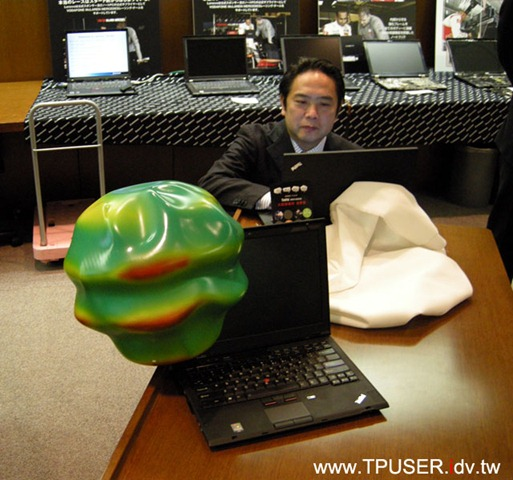

```{r, echo=FALSE, message=FALSE}
#library(swirl)
rm(list=ls())
```

## Taiwan R User Group / MLDM Monday 
<center></center>
http://www.meetup.com/Taiwan-R


<!--######################################################################################-->
# Introduction to R
<!--######################################################################################-->


## R：
R was created by Ross Ihaka and Robert Gentleman at the University of Auckland, New Zealand. The initial version or R released in 1994 and a stable beta version in 2000.
<br>
<center>

https://www.stat.auckland.ac.nz/S-Workshop/
</center>
<br>
https://en.wikipedia.org/wiki/R_(programming_language)

## R:
### What is R?
R is a language and environment for statistical computing and graphics. It is a GNU project which is similar to the S language and environment which was developed at Bell Laboratories (formerly AT&T, now Lucent Technologies) by John Chambers and colleagues. R can be considered as a different implementation of S. There are some important differences, but much code written for S runs unaltered under R.
https://www.r-project.org/about.html

## R:getting popular
### [TIOBE Index for August 2016](http://www.tiobe.com/tiobe-index/)
<center>

</center>


## R:getting popular
### [TIOBE Index for August 2016: The R Programming Language](http://www.tiobe.com/tiobe-index/r/)
<center>

</center>


## R for enterprise:
### Revolution Analytics
[Revolution Analytics: a 5-minute history](http://www.slideshare.net/RevolutionAnalytics/revolution-analytics-a-5minute-history)

<br>
<center>

</center>

## R User Group Sponsorship Program: RevoRUGS
### [User Groups and R Awareness , May 19, 2016](http://blog.revolutionanalytics.com/user-groups/)

<center>

</center>


## R for enterprise:
### [MS CEO Satya Nadella proclaimed **Microsoft loves Linux**](https://www.r-bloggers.com/revolution-analytics-joins-microsoft/)
<center>

</center>

## R for enterprise: 
### 　　　Revolution R Open 　　　　==> 　　　　Microsoft R Open <br>


## R packages and references website:
### [The Comprehensive R Archive Network](https://cran.r-project.org/)
<center>

</center>

### [Microsoft R Application Network](https://mran.microsoft.com/)
<center>

</center>


<!--######################################################################################-->
# Introduction to Sound
<!--######################################################################################-->


## Sound：Wave


 

<br><br><br><br><br><br><br><br><br>
https://en.wikipedia.org/wiki/Waveform

## Sound:
<center>
 
</center>
<br><br>
Fourier series
https://en.wikipedia.org/wiki/Square_wave
https://en.wikipedia.org/wiki/Fourier_series
https://commons.wikimedia.org/wiki/File:Fourier_series_square_wave_circles_animation.gif


## Sound:


### **Frequency,** 
### or its inverse, the Wavelength
<br><br><br><br><br><br><br>
https://en.wikipedia.org/wiki/Sound <br>


## Sound:


### Frequency, or its inverse, the Wavelength
### **Amplitude**
<br><br><br><br><br><br><br>
https://en.wikipedia.org/wiki/Sound <br>


## Sound:


### Frequency, or the Wavelength
### Amplitude
### **Sound pressure / Intensity**
<br><br><br><br><br><br>
http://exp.rockfon.com/performance/acoustics/what+determines+room+acoustics-c7-/sound+pressure+level


## Sound:


### Frequency, or the Wavelength
### Amplitude
### Sound pressure / Intensity
### **Speed of sound** = 340.29 m/s
<br><br><br><br><br><br>
http://physics.stackexchange.com/questions/142098/speed-of-sound-and-break-the-sound-barrier

## Sound:


### Frequency, or the Wavelength
### Amplitude
### Sound pressure / Intensity
### Speed of sound
### **Direction** 
<br><br><br><br><br>
http://www.illusonic.com/dereverberation/ <br>

## Sound:
<center>

</center>
http://www.tpuser.idv.tw/wp/?p=1030

<!--######################################################################################-->
# Introduction to Sound Analysis
<!--######################################################################################-->

## Why 
會學你說話的萌萌小倉鼠 - 要成為一位教宗不是那麼簡單的事情!! | 安啾 (ゝ∀･) ♡ 
<br><br><br>
<center>
[](http://www.youtube.com/watch?v=m8miV2JfeZk "會學你說話的萌萌小倉鼠")
</center>

## Why
<!--
<iframe  title="YouTube video player" width="480" height="390" src="http://www.youtube.com/watch?v=E6kGEKxy_HU" frameborder="0"></iframe>
-->
【木下ゆうか】「今日はね！」を１年分まとめてみた
<br><br><br>
<center>
[](http://www.youtube.com/watch?v=E6kGEKxy_HU "【木下ゆうか】「今日はね！」を１年分まとめてみた")
</center>


## Digital Sound format

<font size="7">
[WAVE PCM soundfile format](http://soundfile.sapp.org/doc/WaveFormat/) <br>
</font>

The WAVE file format is a subset of Microsoft's RIFF specification for the storage of multimedia files.

## Sound format
### Simple Rate:


<br><br><br>
https://en.wikipedia.org/wiki/Sampling_(signal_processing)

## Sound format
### 　　　　　2 bit　　　　　　　　<==> 　　　　　　　3 bit　　 


<br><br><br>
https://en.wikipedia.org/wiki/Quantization_(signal_processing)


## Q & A

## Repect, Diversity

<center>

</center>

## Repect, Diversity
### PyConAPAC 2016 Korea / 파이콘 APAC 2016 
<center>
<br>

</center>

